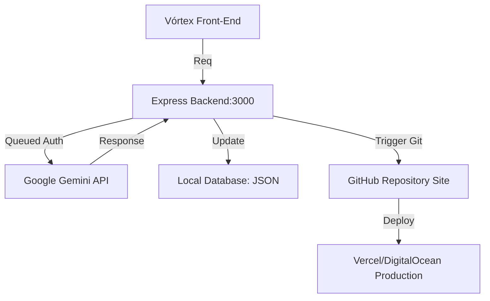

# 🏗️ Arquitetura de Estado (Topologia)

## 📡 Fluxo de Dados do Sistema

## 🧠 Nós de Decisão IA
1.  **Ingestão de DNA:** Lê `estilo_victor.json` para ancorar o `SystemInstruction`.
2.  **Esteira Abidos:** 
    - Passo 1: Geração de Conteúdo.
    - Passo 2: Auditoria Clínica (Filtro Ético).
    - Passo 3: Auditoria Abidos (Neuromarketing).
3.  **On-Demand Switch:** Gatilhos manuais evitam sobreposição de chamadas.

## 🗄️ Persistência de Memória
- **RAM (Curto Prazo):** `estado_atual.md`.
- **Estratégica (Médio Prazo):** `backlog_ideias.md`.
- **Identidade (Longo Prazo/SSOT):** `regras_base.md` + `manual_do_arquiteto.md`.
