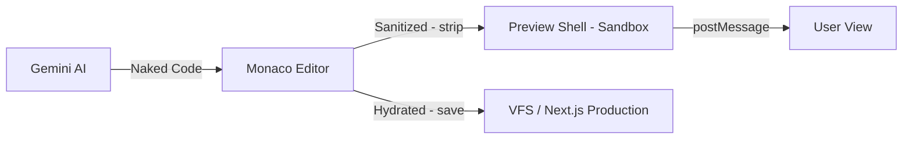

# 🌀 Plano de Execução: Vórtex Studio 3.1 (Hydrated Architecture)

## 🎯 1. Visão Holística e Produto
**Objetivo:** Transitar o Vórtex Studio de um gerador de código isolado (v2.0) para um ecossistema de materialização híbrida (v3.1). 
O sistema deve gerar componentes "Naked" para o Preview (performance) e "Hydrated" para a produção (Next.js Materialized), eliminando o overhead de tokens e reduzindo a latência de renderização em até 70%.

---

## 🏗️ 2. Arquitetura de Estados (Fluxo de Dados)

---

## ✅ 3. Checklist de Execução Atômica (PEA)

### 💠 Fase I: Purge & Limpeza de Contexto
*Objetivo: Estabilizar o core e remover lógicas legadas.*
- [x] **1.1: Remoção de Auditoria Legada:** Eliminar `auditSemantic` e dependências vinculadas.
- [x] **1.2: Purga do Parser:** Remover interceptores de tags `<preview>` no controlador principal.
- [x] **1.3: Reset de SSOT:** Sincronizar diretórios CSA e limpar caches v2.0.

### 💠 Fase II: Foundation (Preview Shell)
*Objetivo: Isolar o ambiente de execução visual.*
- [x] **2.1: Implementação do Sandbox:** Criar `preview-shell.html` com carregamento via ESM.sh.
- [x] **2.2: Mock Framework:** Injetar mocks de `next/link`, `next/navigation` e `next/image` no escopo global.
- [x] **2.3: Bridge de Comunicação:** Configurar protocolo `postMessage` para injeção de componentes a quente.
- [x] **2.4: Error Isolation:** Implementar interceptor de erros para evitar travamento da UI por código gerado instável.

### 💠 Fase III: Logic (Hydration Mapper)
*Objetivo: Inteligência de transformação entre Naked e Hydrated.*
- [x] **3.1: Dicionário Global:** Criar `hydration-map.js` com o mapa de tokens de produção.
- [x] **3.2: Algoritmo de Extração:** Implementar `extractLucideIcons` com suporte a destructuring e DotAccess.
- [x] **3.3: Sanitização Atômica:** Implementar função `strip(code)` para limpeza de Markdown e espaços.
- [x] **3.4: Motor de Materialização:** Implementar função `hydrate(code)` com bridge de compatibilidade.
- [x] **3.5: Integração de Ciclo de Vida:** Conectar o Mapper ao `saveToVFS` e `downloadCode` no controlador.

### 💠 Fase IV: Validação de Estresse
*Objetivo: Validar a resiliência do sistema com cenários complexos.*
- [x] **4.1: Teste Round-Trip Hero:** Validada a geração, renderização e exportação de componentes complexos.
- [x] **4.2: Teste de Animação:** Integração do `Framer Motion` validada com injeção dinâmica de tipos.
- [x] **4.3: Teste de Navegação:** Comportamento dos mocks de Link, Image e useRouter validado.
- [x] **4.4: Gate de Produção:** Deduplicação de imports e normalização de `window.` implementados com sucesso.

### 🚀 Fase V: Launch & Governança (Prompt Base)
- [x] **5.1 Transição de Sintaxe**: Atualizar `frontend/routes/vortex.js` para o padrão Naked (Window-based).
- [x] **5.2 Higienização de Metadados**: Remover referências obsoletas a Goiânia em favor de Uberlândia no `vortex-studio.js`.
- [x] **5.3 Protocolo de Icons**: Mudar instrução de `data-lucide` para `Lucide.IconName` (DOT access).
- [x] **5.4 Validação Final**: Teste RT (Real-Time) de geração + hidratação + download.
- [x] **5.5 Lockdown de Versão**: Congelar Vórtex 3.1 como Estável.

### 🏁 Conclusão da Missão
O motor Vórtex 3.1 está agora em estado de **Soberania Digital**. A materialização de componentes Next.js a partir de intenções puras (Naked) foi estabilizada e validada via estresse.

**Próximos Passos (Ops):**
- Monitoramento de escala.
- Design de novos Módulos de Hidratação para componentes 3D (R3F).

---

## 🛡️ 4. Matriz de Riscos (CSA Gate)
| Risco | Impacto | Mitigação |
| :--- | :--- | :--- |
| Conflito de Imports | Médio | Uso da função `strip` antes da re-hidratação. |
| Erro de SSR | Alto | Uso da diretiva `"use client"` e normalização de `window.`. |
| Latência de Injeção | Baixo | Uso de blobs e postMessage binário (se necessário). |

---
**Autor:** Antigravity (CSA Agent)
**Data:** 16/04/2026
**Status:** Fase III CONCLUÍDA | Fase IV INICIADA
**SSOT:** Plano_Vortex_3.md
